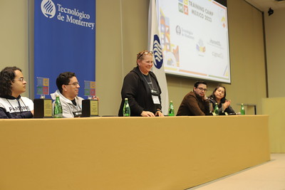
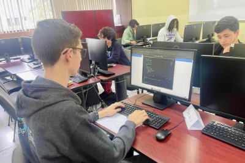
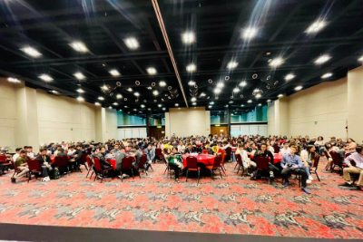
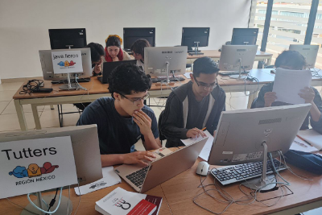

# Where is huronOS Being Used?

huronOS is actively utilized by numerous competitive programming communities. Due to huronOS's commitment to privacy and the absence of telemetry, we do not maintain a comprehensive list of all users. However, we collaborate closely with several key organizations.

Here are some notable examples:

### **[Training Camp Mexico](https://tcmx.icpcmexico.org)**
The TCMX (Training Camp Mexico) serves as the *official* training camp for the ICPC Mexico region, where huronOS plays a crucial role in constructing the contest environment. This annual event gathers the LATAM Champions of the ICPC World Finals to mentor and prepare multiple teams aspiring to reach the regional finals.

### **[Mexican Olympiad of Informatics](https://www.olimpiadadeinformatica.org.mx)**
huronOS is the designated operating system for the Mexican Olympiad of Informatics (OMI), which is the final competition prior to selecting the Mexican delegation for the **[International Olympiad in Informatics](https://ioinformatics.org)**. Our team ensures that the system aligns with and is continuously updated according to OMI's requirements.

### ICPC "Gran Premio de México"
The "Gran Premio de México" functions as the qualifying rounds for the ICPC Mexico Regional Finals. This is a synchronized multi-location contest hosted by various universities, many of which rely on huronOS to facilitate their competitions. Notable universities utilizing huronOS include:
- Benemérita Universidad Autónoma de Puebla (BUAP)
- Centro de Nanociencias y Nanotecnología Baja California Sur de la Universidad Nacional Autónoma de México (CNyN-UNAM)
- Escuela Superior de Cómputo del Instituto Politécnico Nacional (ESCOM-IPN)
- Escuela Superior de Física y Matemáticas del Instituto Politécnico Nacional (ESFM-IPN)
- Facultad de Estudios Superiores Acatlán de la Universidad Nacional Autónoma de México (FESA-UNAM)
- Facultad de Ingeniería de la Universidad Nacional Autónoma de México (FI-UNAM)
- Tecnológico de Monterrey, Monterrey Campus (ITESM-MTY)
- Tecnológico de Monterrey, Guadalajara Campus (ITESM-GDL)
- Tecnológico de Monterrey, Puebla Campus (ITESM-PUE)
- Universidad Autónoma de Nuevo León (UANL)
- Universidad Nacional de Colombia (UNAL)

